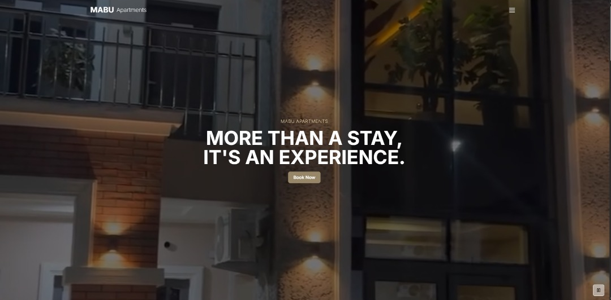

# 🏡 mabuapartments-showcase

A showcase of a full-stack Airbnb-style client project built with **Next.js**, **Paystack**, and **PostgreSQL**.

🌐 [Live Demo](https://www.mabuapartments.com/)  
🔒 **Note**: Source code is private due to client confidentiality.

---

## 🚀 Tech Stack

### 🎨 Frontend

- ⚛️ **Next.js 15** – React framework with App Router
- 🧠 **TypeScript** – Type-safe development
- 🌈 **Tailwind CSS** – Utility-first CSS framework
- 🌀 **Framer Motion** – Smooth animation library
- 📝 **React Hook Form** – Intuitive form handling
- 🧪 **Zod** – Schema validation
- 🧱 **Shadcn/UI** – Modern component library
- 🎯 **Lucide React** – Icon set for clean UI

### 🗄️ Backend & Database

- 🌐 **Next.js API Routes** – Server-side logic
- 🔧 **Prisma ORM** – Database toolkit
- 🛢️ **PostgreSQL (Neon)** – Serverless relational DB
- ⚙️ **Server Actions** – Seamless server-side execution

### 💸 Payment & Communication

- 💰 **Paystack** – Payment processing integration
- 💬 **WhatsApp API** – Direct messaging
- 📧 **Nodemailer** – Email confirmations

### ☁️ Deployment & Infrastructure

- ▲ **Vercel** – Hosting & CI/CD
- 🧬 **Neon Database** – Scalable serverless PostgreSQL
- 🌍 **Custom Domain** – Branded domain setup

---

## ✨ Key Features

### 🏠 Property Management

- 🛏️ **Multiple Room Types** – Studio, One-bedroom, Two-bedroom
- 🖼️ **Dynamic Image Galleries** – Interactive carousels
- 📄 **Detailed Property Pages** – Info-rich listings
- 📱 **Responsive Design** – Optimized for all devices

### 📅 Booking System

- 🟢 **Real-time Availability** – Live calendar updates
- 📆 **Date Range Picker** – Easy selection
- 💵 **Pricing Calculator** – Dynamic total cost
- 🔐 **Availability Logic** – Prevents double bookings

### 💳 Payment Integration

- 🔗 **Paystack Integration** – Secure payments
- 🧾 **Multiple Payment Options** – Card, transfer, USSD, more
- ✅ **Payment Verification** – Confirm bookings securely
- 📥 **Booking Confirmation** – Automated email receipts

### 📱 Communication Features

- 🟢 **WhatsApp Integration** – Instant messaging with host
- 📬 **Email Notifications** – Auto responses & updates
- 📇 **Contact Forms** – Seamless inquiries

### 🧑‍🎨 User Experience

- 🧼 **Modern UI/UX** – Sleek and professional
- 🕹️ **Interactive Elements** – Hover effects and animations
- 🔄 **Loading States** – Feedback and error handling
- ♿ **Accessibility** – Inclusive design for all users

### 📊 Content Management

- 📚 **Dynamic Content** – DB-driven listings
- 🌟 **Review System** – Ratings & guest feedback
- ❓ **FAQ Section** – Expandable help section
- 🏢 **About Pages** – Company info and location

### 🍞 Additional Features

- 🥐 **Bakery Menu** – Rayuwa Bakery integration
- 🗺️ **Location Info** – Nearby landmarks
- 💬 **Testimonials** – Real user reviews
- ✉️ **Newsletter Signup** – Email subscription

### 🧠 Technical Features

- ⚡ **Server-Side Rendering** – SEO-friendly
- 🛡️ **Error Boundaries** – Resilient UI handling
- 🧮 **Database Optimization** – Fast queries
- 🔐 **Type Safety** – Full TypeScript support
- 🖼️ **Responsive Images** – Optimized loading

---

## 🖼️ Screenshots

### 🏠 Homepage  
*Modern hero section with video background and call-to-action*  

### 📋 Property Listings  
*Clean property grid with filtering and detailed information*  

### 📅 Booking Interface  
*Interactive calendar with real-time availability checking*  

### 🏘️ Property Details  
*Comprehensive property information with image galleries*  

### 📱 Mobile Experience  
*Fully responsive design optimized for mobile devices*  

---

## 🚧 Development Status

⚠️ **Important Note**: The complete booking functionality is currently in development and **not fully live yet**. The **Paystack integration is ready and functional**, but we're waiting for final client verification and approval from Paystack to enable live transactions.

The current live demo includes:

- ✅ Full user interface
- ✅ Room browsing
- ✅ Availability checking
- 🚫 Payments temporarily disabled (awaiting approval)
- ✅ WhatsApp direct messaging (fully functional)

📅 **Expected Completion**: Pending Paystack verification and client go-live confirmation.
